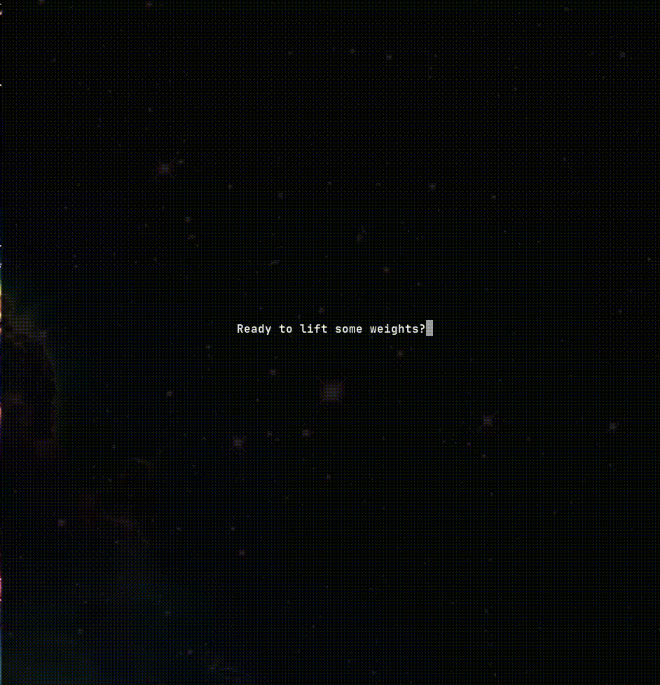

# alleno-ora

> Not actively working on this anymore, I am making a CLI version to focus on simplicity. This can be found here: https://github.com/ElPatatone/alleno-ora

Alleno ora means I train now in italian.  
This is a TUI application written in C with the Ncurses library to help manage and see your workout progress.

## Installation

To install and use this program clone the repo in your desired location. In the `src` folder make a `config.txt`, in it put the path where you would like the `workout.txt` file to be stored, the file will hold all the workout information.  
The path should be in a single line like this: `/home/user/Documents/workouts.txt`  
Make sure to not use the `~` to specify the root directory as this will not be parsed correctly in the program, you can find the full path of where you would like to store the file using the command `realpath workouts.txt`

The project uses Cmake to manage the build, you can run the `build.sh` file in the build directory and it will run cmake and make to build the executatble, you can then run the executable `./alleno` to run the program. However, I reccomend creating an alias in your
shell config, this would let you run the program from anywhere without needing to be in the project directory.  
Just specify the path where you have cloned the repo and replace the path example path below while keeping the rest of the code the same.
In `zsh` it is done like this:

```shell
alias alleno="cd ~/path/alleno-ora/build && ./alleno && cd -"
```

I have plans in the future to make a binary you can add to your path to run it globally more easily.

## Features

Right now the program has this options:

1. Add workout
2. Add PR
3. Add Injury
4. Remove workout
5. Remove Lift
6. Display workout
7. Display PR
8. Display Injury

## Demo


